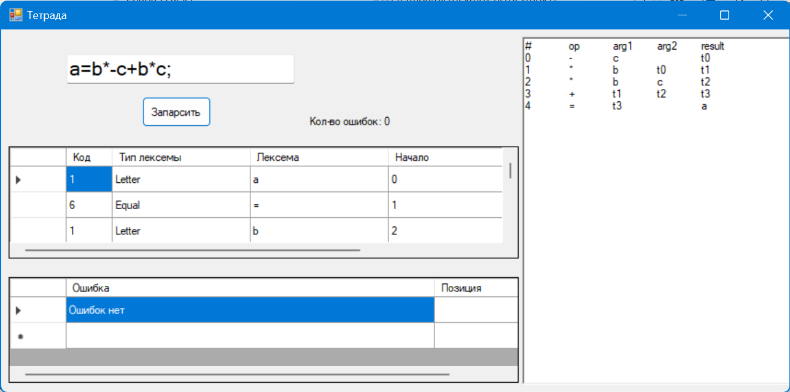
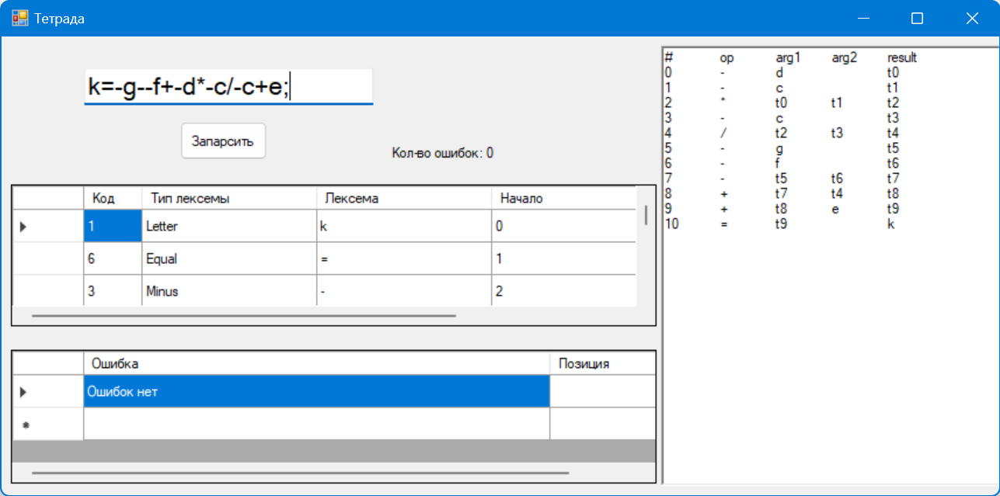
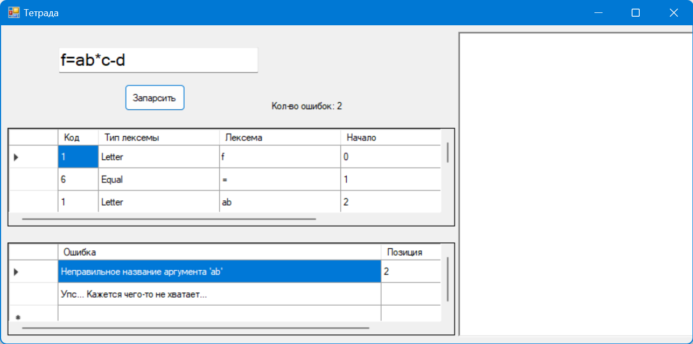
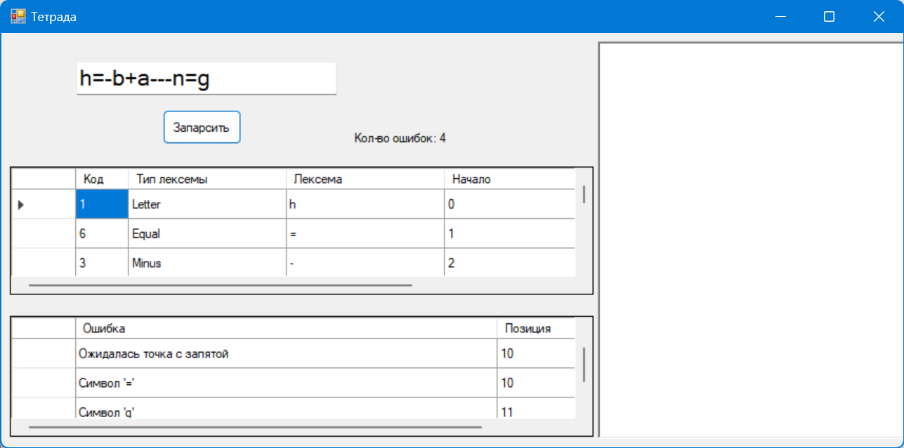
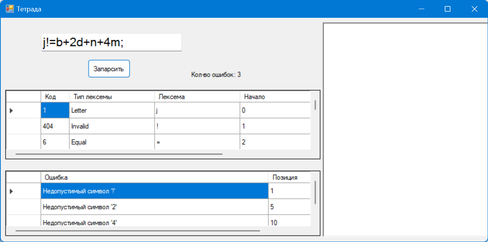

# Лабораторная работа №5
# Включение семантики в анализатор. Создание внутренней формы представления программы.

## В качестве внутренней формы представления программы выберем Многоадресный код с явно именуемым результатом (тетрады)

## Цель работы: Дополнить анализатор, разработанный в рамках лабораторных работ, этапом формирования внутренней формы представления программы.

## Задание: Реализовать алгоритм записи арифметического выражения в виде тетрады.

## Примеры верных строк
a=b*-c+b*c; 
a=-g+a*h+-s/r; 
k=-g--f+-d*-c/-c+e; 

## Тестовые примеры

